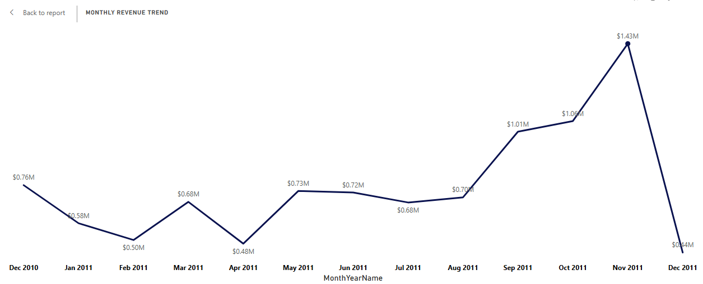

# SALES ANALYSIS (Dec 2010 - Dec 2011)

## Problem Statement

The business sells giftware products to wholesalers across multiple countries. While the store had detailed transaction-level sales data, management lacked clear insights into sales performance, profitability, and customer trends.

***The goal of this project was to***

- Analyze the wholesale sales data to uncover trends in revenue, orders, and customer activity
- Identify the top-performing products, customers, and markets.
- Measure the impact of returns on net revenue.
- Visualize findings in a dashboard to support data-driven decision-making for growth, inventory planning, and customer relationship management

## Data Used

The Dataset used was sourced from the UCI Machine Learning Repository

## Data Cleaning

Data Cleaning was done using MS Excel

- Removed duplicates
- Removed non-product entries and missing product descriptions. 
(negative quantities, null values, canceled invoices).
- Standardized product descriptions.
- Standardized product descriptions.
  
`=PROPER(TRIM(CLEAN([@Description])))`

Detected non-product transactions (e.g., service charges, shipping)

`=IF(OR(ISNUMBER(SEARCH("BANK CHARG", UPPER([@Description]))),
       ISNUMBER(SEARCH("POST", UPPER([@Description]))),
       UPPER([@StockCode])="M"), "NonProduct", "Product")`

- Separated sales from returns to calculate net revenue accurately.
- Cross-checked totals between SQL outputs and Excel to ensure completeness and validate data quality

## Data Analyis

***Tools Used*** 

- MS Excle for data exloration, cleaning, EDA, and quality checks
- SQL Server for data quality checks and analysis 
- PowerBI DAX for computing KPIs and Vsualization
- Checked and removed  Outliers (extreme quantities). I identified 7 extreme outlier rows (quantities > 4800 or < -3000) which likely represent bulk adjustments or errors. These were excluded from the main analysis to avoid distortion

## Sales Overview Analysis

Understand revenue, order patterns, and seasonality with SQL 

Revenue = SUM(Quantity * UnitPrice)

`SELECT ROUND(SUM(Quantity*UnitPrice),0) AS Revenue
FROM Retail201011;`

During this period, the store generated sales revenue of $9.78 Million.

***Total Number of Customers***

`SELECT COUNT(DISTINCT CustomerID) AS Total_Customers
FROM Retail201011
WHERE CustomerID IS NOT NULL;`

***Average Order Value (AOV) = Total Revenue ÷ Total Orders***

`SELECT 
    YEAR(InvoiceDate) AS Year,
    MONTH(InvoiceDate) AS MonthNumber,
    DATENAME(MONTH, InvoiceDate) AS MonthName,
    ROUND(SUM(Quantity * UnitPrice) * 1.0 / COUNT(DISTINCT InvoiceNo), 0) AS AvgOrderValue
FROM Retail201011
WHERE CustomerID IS NOT NULL
GROUP BY YEAR(InvoiceDate), MONTH(InvoiceDate), DATENAME(MONTH, InvoiceDate)
ORDER BY Year, MonthNumber;`

***Sales Trend Over Time → PivotTable***
Sales Trend overtime was analyzed using pivot table and chart. 

***Monthly Revenue Trend perfomance Overtime 

***Orders By Countries*** 

***Return Analysis***

Returns analysis was critical to ascertain the impact of returns on the business revenue
% of Sales that are Returns = 2%

***Top Products Returned → PivotTable***

***Country-Level Returns - Top 10***

***Bottom 10 Countries with the least returns***

***Profitability Across Months - Seasonality Analysis***

- November 2011 had the highest number of orders $1.43Million in revenue, clearly the busiest month, but interestingly, September and October had the highest average order value (AOV) of about $459 and $477 compared to November $453. The store is attracting lots of customers in November, but they are buying lower-value items.

  

***Weak Month: April***

- April had moderate order volume, but the lowest AOV ($311), showing that customers are buying smaller, cheaper products, hence, sales strategies such as discounts or campaigns may not be effective in improving perfomance. It will be beneficial if the store should re-evaluate April campaigns and product mix, and push for higher value products to lift profitability.

***Market Dependency***

- The UK accounts for $6.8M, or rather 70% of total sales, making the store heavily dependent on one market.
- It also reveals a revenue concentration risk, hence, more marketing efforts should be made towards developing underperforming markets for instance Germany, France, and Australia to reduce reliance on UK customers.

***Product & AOV Performance***

- Products like Chilli Lights ($80.34/order) and Regency Cakes ($75.82/order) drove the highest AOV, showing premium appeal.
- Premium items increase profitability despite fewer sales, hence, the store can prioritize stocking and promoting high-AOV items and create bundles to raise average spend across all orders.

***Customer Returns***

- Return rate was low at 2.35%, but still amounted to $230K in losses.
- This means a small percentage of products may be driving most returns. Investigations should be conducted on frequently returned products to address packaging or quality issues.

## Impact and Business Value

The analysis provided the store manager with a clear roadmap for revenue growth.

- Maximize holiday season profitability by pushing higher-value bundles.

- Fix weak months like April with smarter campaigns.

- Diversify markets to reduce dependency on the UK.

- Use premium product categories to drive profitability.

- Control losses by investigating return patterns.
